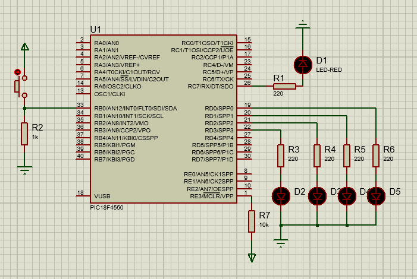

# Interrupciones RB0
Práctica de interrupciones externas usando en el pin RB0.
El circuito ejecuta una secuencia de LEDs. Cuando detecta una interrupción en el pin RB0 (pulsando el botón),
la secuencia se detiene, entonces se enciende y se apaga un LED en el pin RC7. Cuando la función de interrupción finaliza, 
la secuencia continua.

