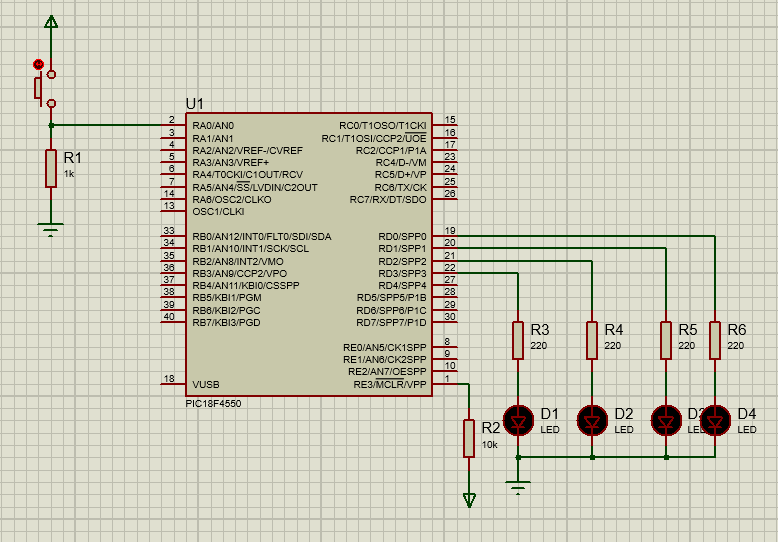

# Antirebote en Pulsadores
Los rebotes son pequeñas fluctuaciones o variaciones en la señal de voltaje que provocan
errores en las lecturas digitales.

Normalmente los rebotes se perciben más en botones o pulsadores, sin embargo hay formas de
resolver este problema, mediante hardware o software.

Para esta práctica se realizará por software.

