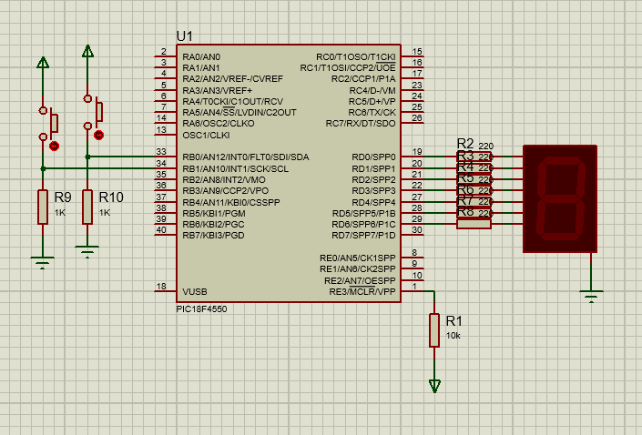

# Control de displays de 7 segmentos
Práctica para controlar un display de 7 segmentos.
Al presionar un pulsador se muestran los números de forma ascendente; al presionar el otro pulsador se
muestran de forma descendente.

